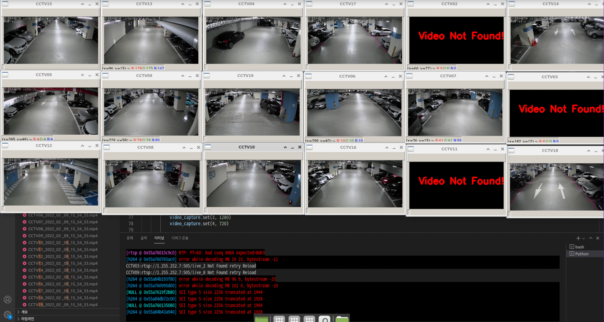

# 보행자 지도 표시

안양 SK V1센터 지하 주차장을 대상으로 yolov5를 이용하여 보행자를 인식하고 보행자의 Bounding Box 중심 하단 좌표 값을 Homography를 이용하여 지도 좌표로 변환하여 지도 위에 표시한다.
실시간성과 여러 CCTV로부터 동시에 지도에 표시하기 위해서 멀티 프로세싱을 하였으며, 현재 5개의 CCTV만을 가지고 구현하였다. yolov5 같은 경우 torch hub를 이용하여 사용 


## main.py

multidetect 와 show_image라는 멀티 프로세스를 생성하여 지도 위에 표시한다. 이 때 multidetect는 각각의 CCTV마다 생성되어지는 프로세스이며 show_image는 각각의 CCTV에서 얻어낸 좌표 값을 지도 위에 한번에 표시해주는
프로세스로서 하나만 존재한다.


## 사용 방법

1.main.py
```
git clone https://git.watchmile.com/jmkabc31/pedestrain2map.git
cd pedestrain2map
//소스코드 내부안에서 검출한 이미지나 영상 자료 , 검출 영역 크기 설정

//검출할 이미지나 영상 정보 입력후
python main.py //실행
```

2.pixelpicker

```
cd pedestrain2map

//소스코드내에서 구하고자 하는 CCTV, MAP 이미지 경로를 CCTV_PATH, MAP_PATH의 입력

python pixelpicker.py
```
마우스 왼쪽 클릭 -> 좌표 확인

마우스 오른쪽 클릭 -> 좌표 삭제

ESC -> 종료 

### 예시


3. computeMat.py

```
# pixelpicker로 얻은 매칭되는 픽셀 좌표 값을 소스 안에 입력

# pts_src=np.float32([[1269,605],[42,442],[17,712],[1261,709]]) #cctv
# pts_dst=np.float32([[1100,1946],[615,1954],[945,2147],[1078,2079]]) #map

#실행
python computeMat.py

#결과 값으로 나온 Homography 행렬 값을 config_hd_2.py안에 각각의 CCTV별로 'homoMat'에 입력
```

### 예시


3. getPersonImage.py

```
# getPersonImage.py로 보행자 이미지 자동 수집

#실행
python getPersonImage.py

#자동으로 CCTV_Person 폴더 안에 보행자 이미지들 저장
```